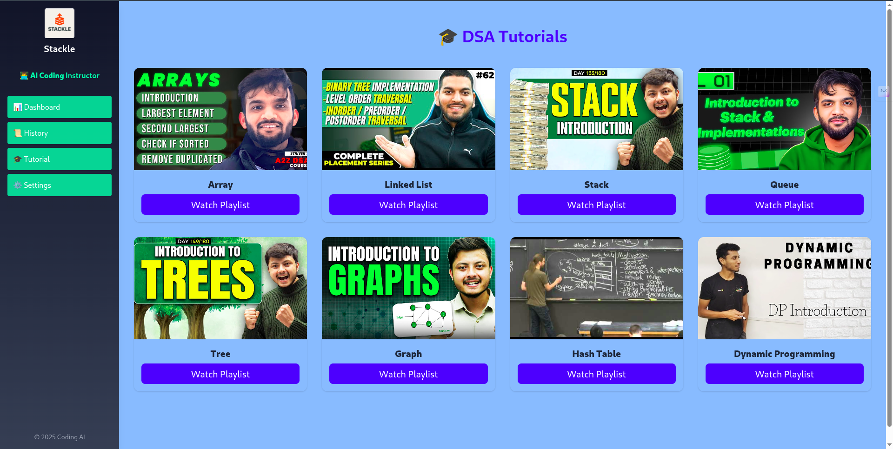

# 📚 DSA Instructor AI

A full-stack web application that helps you learn and practice Data Structures & Algorithms with the assistance of an AI-powered coding instructor.
Built with **React**, **Node.js**, **Express**, and integrates with Gemini API.

---

## 🌟 Features

- ✅ Ask coding questions in any programming language — get AI-generated answers.
- ✅ Track number of questions you’ve solved.
- ✅ See the last time you solved a question.
- ✅ Visualize topic-wise breakdown in a bar chart.
- ✅ Curated tutorials with embedded YouTube playlists.
- ✅ Responsive, modern UI with TailwindCSS & Material-UI.

---

## 🖼️ Screenshots

| Dashboard | Tutorials |
|-----------|-----------|
|  |  |

---

## 🚀 Tech Stack

- Frontend: **React**, **TailwindCSS**, **Vite**, **Material-UI**
- Backend: **Node.js**, **Express**, **dotenv**
- AI: **Gemini API**
- Charting: **Chart.js**
- State Management: **React Hooks**

---

## 🛠️ Setup & Run

### 📥 Clone the repository

```bash
git clone https://github.com/yourusername/dsa-instructor.git
cd dsa-instructor
