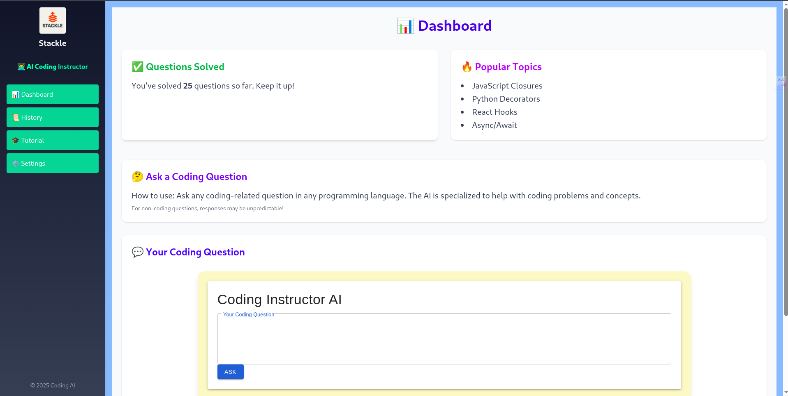

📚 DSA Instructor AI
A full-stack web application that helps you learn and practice Data Structures & Algorithms with the assistance of an AI-powered coding instructor.
Built with React, Node.js, Express, and integrates with Gemini API.

🌟 Features
✅ Ask coding questions in any programming language — get AI-generated answers.
✅ Track number of questions you’ve solved.
✅ See the last time you solved a question.
✅ Visualize topic-wise breakdown in a bar chart.
✅ Curated tutorials with embedded YouTube playlists.
✅ Responsive, modern UI with TailwindCSS & Material-UI.

🖼️ Screenshots
Dashboard	Tutorials

🚀 Tech Stack
Frontend: React, TailwindCSS, Vite, Material-UI

Backend: Node.js, Express, dotenv

AI: Gemini API

Charting: Chart.js

State Management: React Hooks

🛠️ Setup & Run
📥 Clone the repository
bash
Copy
Edit
git clone https://github.com/yourusername/dsa-instructor.git
cd dsa-instructor
⚙️ Install dependencies
Backend:
bash
Copy
Edit
cd backend
npm install
Frontend:
bash
Copy
Edit
cd ../frontend
npm install
🔑 Set up environment variables
In the backend/ folder, create a .env file:

ini
Copy
Edit
PORT=5000
GEMINI_API_KEY=your_gemini_api_key_here
🖥️ Run the application
Development mode:
At the root of the project:

bash
Copy
Edit
npm run dev
This will start:

Backend server at http://localhost:5000

Frontend app at http://localhost:5173

📊 API Endpoints
POST /api/ask
Ask a coding question.
Request body:

json
Copy
Edit
{ "question": "How does a binary search work?" }
Response:

json
Copy
Edit
{ "answer": "Binary search works by..." }
GET /api/stats
Fetch solved stats.
Response:

json
Copy
Edit
{
  "solvedCount": 26,
  "lastSolved": "2025-07-12T18:42:00Z",
  "topics": {
    "JavaScript Closures": 11,
    "Python Decorators": 5
  }
}
✍️ Contributing
Pull requests are welcome. For major changes, please open an issue first to discuss what you’d like to change.

📄 License
This project is licensed under the MIT License. See the LICENSE file for details.
